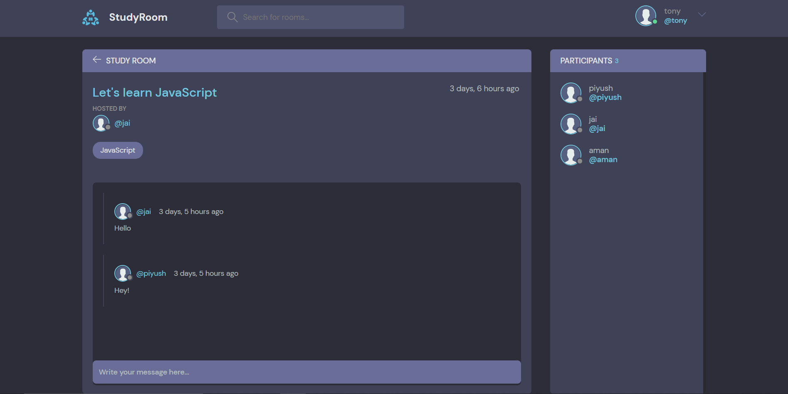

# StudyRoom

A web application which allows user to create and discover study rooms and facilitates finding study partners.

### Built With

- Python
- Django

### Cloning the repository

--> Clone the repository using the command below :

```bash
git clone https://github.com/divanov11/StudyBud.git

```

--> Move into the directory where we have the project files :

```bash
cd studyroom

```

--> Install the requirements :

```bash
pip install -r requirements.txt

```

#

### Running the App

--> To run the App, we use :

```bash
python manage.py runserver

```

#

### App Preview :

<table width="100%"> 
<tr>
<td width="50%">      
&nbsp; 
<br>
<p align="center">
  Feed Home
</p>

</td> 
<td width="50%">
<br>
<p align="center">
  Room Preview
</p>
  
</td>
<tr>
<td width="50%">
<br>
<p align="center">
  User Profile
</p>
  
</td>
</table>

#

### Theme :

https://github.com/divanov11/StudyBud/tree/master/theme
